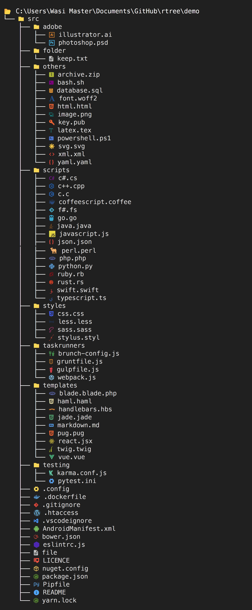

# rtree

 A better tree command with beautiful icons and colors made in Python

## Demo

The following image is in high quality and captured from a terminal, <a target="_blank" href="https://github.com/wasi-master/rich-tree/blob/main/screenshot.png">open it in a new tab</a> to view it clearly, For even better preview, download the [`demo.html`](https://raw.githubusercontent.com/wasi-master/rich-tree/main/demo.html) file and open it in a web browser



## Usage

The library is still in beta so expect some bugs.

Firstly you'll need to install it from github using [pip](https://github.com/pypa/pip "The python package manager")

```sh
pip install git+https://github.com/wasi-master/rich-tree
```

Then you can run the `rtree` command or `python -m rtree` command to view the tree. Run `rtree --help` for more information

You can also optionally alias `rtree` to `tree` so that running tree runs rtree instead

#### Powershell

Add the following line to [your powershell profile](https://docs.microsoft.com/en-us/powershell/module/microsoft.powershell.core/about/about_profiles?view=powershell-7.2#the-profile-files)

```pwsh
Set-Alias -Name tree -Value "rtree"
```

#### Bash, ZSH, Fish etc.

Add the following line to your bash/zsh/fish profile, for more info search how to add aliases for your specific shell in google.

```sh
alias tree="rtree"
```